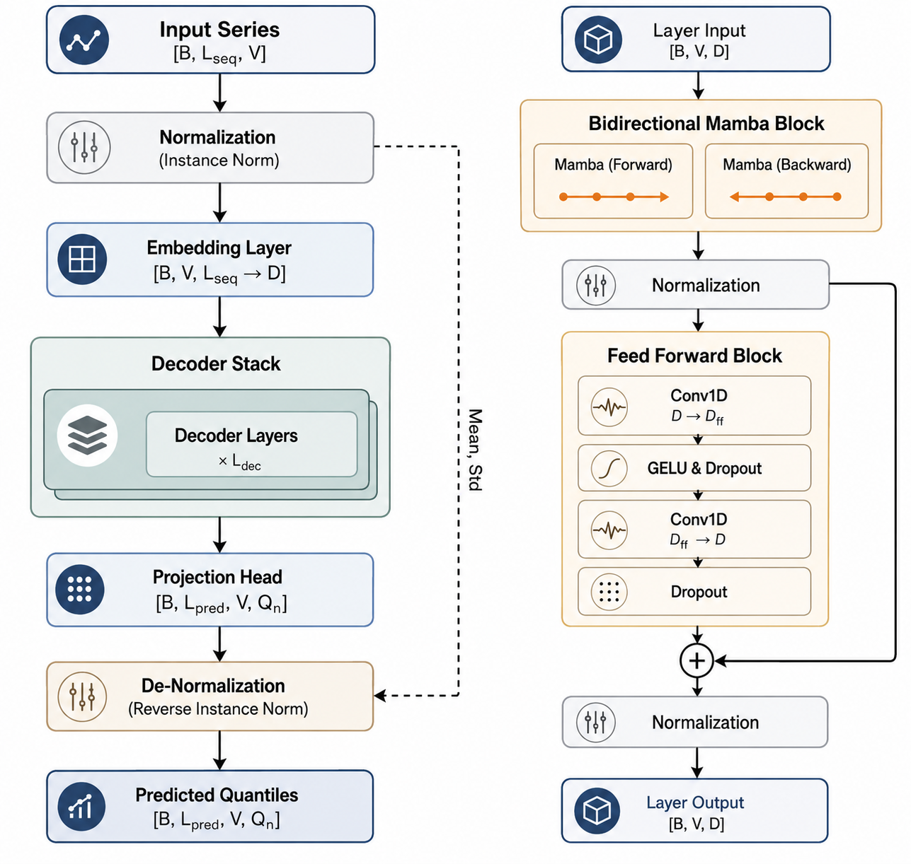
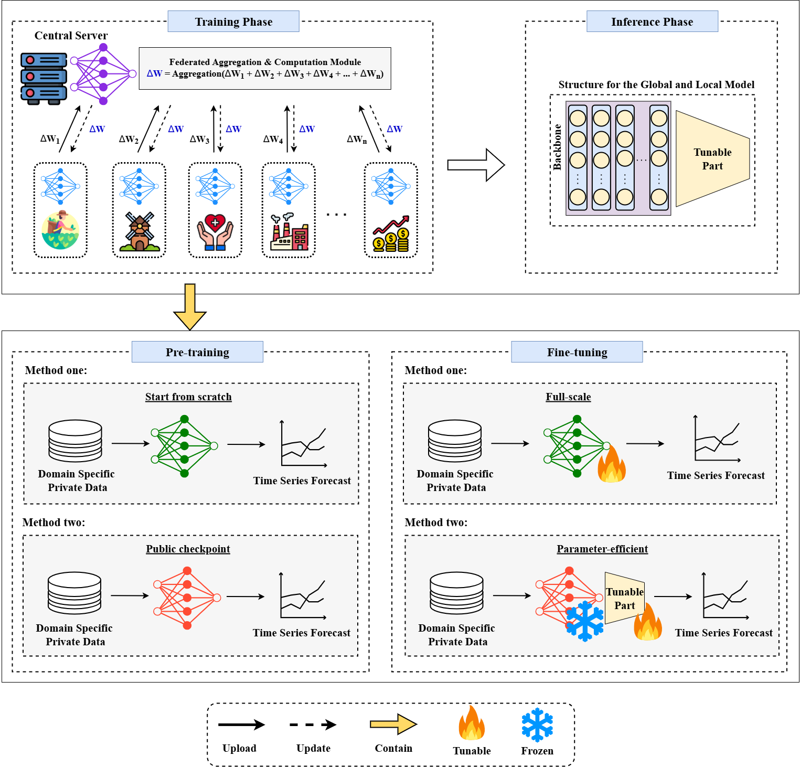

# 🌊 QuantFlow

**A Federated Post-Transformer Foundation Model for Probabilistic Time-Series Forecasting**



*QuantFlow: overall architecture (left) and bidirectional Mamba decoder layer (right)*



*Proposed Federated Training and Model Adaptation Pipeline*


## Key Contributions

* **Bidirectional Mamba Decoders:** Replaces $O(N^2)$ Transformer attention with 6 stacked forward/reverse Mamba layers, achieving linear complexity and superior long-term dependency extraction[cite: 6].
* **Inverted Sequence Embedding:** Encodes entire observation windows (100 steps) as tokens, forcing the model to explicitly learn cross-variable interactions and time-varying dynamics[cite: 6].
* **Probabilistic Quantile Forecasting:** Moves beyond point estimates by simultaneously predicting 5 conditional quantiles ($0.10, 0.25, 0.50, 0.75, 0.90$) to model predictive uncertainty and market risk[cite: 6].
* **Federated Pre-training (FL):** Designed for a 20-client non-IID setup, successfully maintaining high accuracy after only 3 communication rounds while preserving strict data locality[cite: 6].
* **TSMixup Augmentation:** Expands temporal manifold coverage via Dirichlet-weighted interpolation, creating novel combinations of trends and periodic signals[cite: 6].


## Main Results


### State-of-the-Art Comparison (Centralized)

*Below is a comparison of MSE on standard benchmarks. Lower is better.*[cite: 6]

| Model | ETTm1 (MSE) | Weather (MSE) |
| --- | --- | --- |
| FEDformer | 0.448 | 0.308 |
| iTransformer | 0.407 | 0.257 |
| PatchTST | 0.400 | 0.258 |
| TimesNet | 0.387 | 0.259 |
| TimeMixer | 0.381 | 0.240 |
| Time-MoE Large | 0.322 | 0.234 |
| **QuantFlow (Ours)** | **0.2834** | **0.2218** |

### Federated Non-IID Performance

QuantFlow maintains highly competitive metrics even when trained across 20 decentralized clients with non-IID data distributions[cite: 6].

| Dataset | Fed. MAE | Fed. $R^2$ | Centralized $\Delta R^2$ |
| --- | --- | --- | --- |
| **Electricity** | 262.43 | 0.9395 | -0.0494 |
| **ETTm1** | 0.4072 | 0.9421 | -0.0496 |
| **ETTm2** | 0.6319 | 0.9465 | -0.0498 |
| **Bitcoin** | 2520.26 | 0.8926 | -0.0470 |
| **SF Traffic** | 0.0148 | 0.9135 | -0.0481 |


## Installation

Ensure you have a CUDA-compatible GPU (e.g., AWS g5.4xlarge with NVIDIA A10G) to compile the Mamba kernels.

```bash
# 1. Clone the repository
git clone https://github.com/nawaz0x1/QuantFlow.git
cd QuantFlow

# 2. Create and activate a virtual environment
python -m venv venv
source venv/bin/activate  # On Windows use `venv\Scripts\activate`

# 3. Install dependencies
pip install -r requirements.txt

```

---

## Quick Start

### 1. Data Preparation

Place your raw time-series data (e.g., `data.csv`) in the root directory. The preprocessor will automatically generate cyclic calendar features, perform instance-wise Min-Max scaling, and output processed tensors to `processed_data/`.

```bash
python src/preprocess.py
```

### 2. Model Training

Train the bidirectional Mamba architecture. The script automatically handles the pinball loss computation for quantile regression and exports the optimized model to ONNX format upon completion.

```bash
python train.py
```

## Citation

If you find this code or our paper useful in your research, please consider citing:

```bibtex

```

**Authors & Affiliations:**

* **Shah Nawaz Haider** & **Steve Austin** — *Department of Computer Science and Engineering, University of Science and Technology Chittagong (USTC)*
* **Arnab Barua** & **Sarowar Morshed Shawon** — *Department of Electrical and Electronic Engineering, USTC*